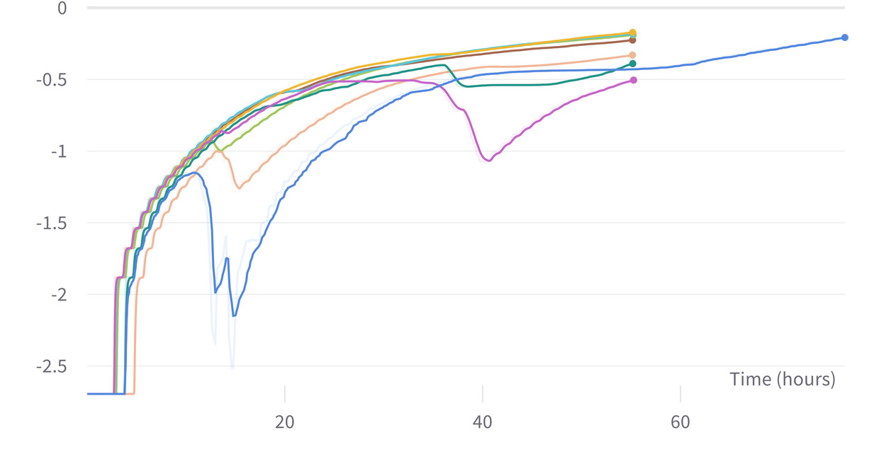
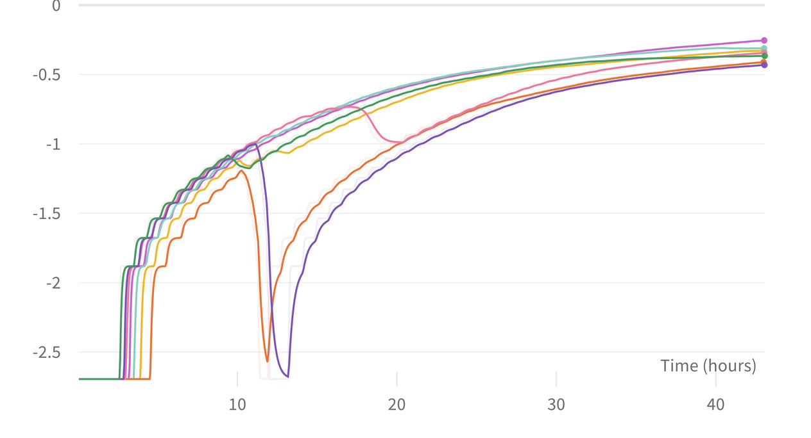

# To run experiments with Manual DR settings

If you are using a single GPU, run the following command to train DeXtreme RL policies with Manual DR

```
HYDRA_MANUAL_DR="train.py multi_gpu=False\ 
task=AllegroHandDextremeManualDR \
task.env.resetTime=8 task.env.successTolerance=0.4 \
experiment='allegrohand_dextreme_manual_dr'\
headless=True seed=-1 \
task.env.startObjectPoseDY=-0.15 \
task.env.actionDeltaPenaltyScale=-0.2 \
task.env.resetTime=8 \
task.env.controlFrequencyInv=2 \
train.params.network.mlp.units=[512,512] \
train.params.network.rnn.units=768 \
train.params.network.rnn.name=lstm \
train.params.config.central_value_config.network.mlp.units=[1024,512,256] \
train.params.config.max_epochs=50000 \
task.env.apply_random_quat=True \


python ${HYDRA_MANUAL_DR}
```

The apply_random_quat=True flag samples unbiased quaternion goals which makes the training slightly hard. We use a successTolerance of 0.4 radians in these settings overriding the settings in AllegroHandDextremeManualDR.yaml.

# To run experiments with Automatic Domain Randomisation (ADR)

The ADR policies are trained with a successTolerance of 0.1 radians and use LSTMs both for policy as well as value function. For ADR on a single GPU, run the following commands to train the RL policies 

```
HYDRA_ADR="train.py multi_gpu=False \
task=AllegroHandDextremeADR \
headless=True seed=-1 \
task.env.resetTime=8 \
task.env.controlFrequencyInv=2 \
train.params.config.max_epochs=50000 \
wandb_activate=True wandb_group=multi_gpu wandb_project=dextreme"

python ${HYDRA_ADR}
```


If you want to do `wandb_logging` you can also add the following to the `HYDRA_MANUAL_DR` 

```
wandb_activate=True wandb_group=group_name wandb_project=project_name"
```

To log the entire isaacgymenvs code used to train in the wandb dashboard you can add: 

```
wandb_logcode_dir=<isaac_gym_dir>
```

# Loading checkpoints

To load a given checkpoint using ManualDR, you can use the following  


```
python train.py task=AllegroHandDextremeManualDR \
num_envs=2048 checkpoint=<your_checkpoint_path> \
test=True \
task.env.printNumSuccesses=True \
headless=True
```

and for ADR, add `task.task.adr.adr_load_from_checkpoint=True` to the command above, i.e.

```
python train.py task=AllegroHandDextremeADR \
num_envs=2048 checkpoint=<your_checkpoint_path> \
test=True \
task.task.adr.adr_load_from_checkpoint=True \
task.env.printNumSuccesses=True \
headless=True
```

It will also print statistics and create a new `eval_summaries` directory logging the performance for test in a tensorboard log. For the ADR testing, it is will also load the new adr parameters (they are saved in the checkpoint and can also be viewed in the `set_env_state` function in `allegro_hand_dextreme.py`). You should see something like this when you load a checkpoint with ADR 

```
=> loading checkpoint 'your_checkpoint_path'
Loaded env state value act_moving_average:0.183225
Skipping loading ADR params from checkpoint...
ADR Params after loading from checkpoint: {'hand_damping': {'range_path': 'actor_params.hand.dof_properties.damping.range',
 'init_range': [0.5, 2.0], 'limits': [0.01, 20.0], 'delta': 0.01, 'delta_style': 'additive', 'range': [0.5, 2.0], 
 'next_limits': [0.49, 2.01]}, 'hand_stiffness': {'range_path': 'actor_params.hand.dof_properties.stiffness.range', 
 'init_range': [0.8, 1.2], 'limits': [0.01, 20.0], 'delta': 0.01, 'delta_style': 'additive', 'range': [0.8, 1.2], 
 'next_limits': [0.79, 1.21]}, 'hand_joint_friction': {'range_path': 'actor_params.hand.dof_properties.friction.range', 
 'init_range': [0.8, 1.2], 'limits': [0.0, 10.0], 'delta': 0.01, 'delta_style': 'additive', 'range': [0.8, 1.2], 
 'next_limits': [0.79, 1.21]}, 'hand_armature': {'range_path': 'actor_params.hand.dof_properties.armature.range', 
 'init_range': [0.8, 1.2], 'limits': [0.0, 10.0], 'delta': 0.01, 'delta_style': 'additive', 'range': [0.8, 1.2], 
 'next_limits': [0.79, 1.21]}, 'hand_effort': {'range_path': 'actor_params.hand.dof_properties.effort.range', 
 'init_range': [0.9, 1.1], 'limits': [0.4, 10.0], 'delta': 0.01, 'delta_style': 'additive', 'range': [0.9, 1.1], 
 'next_limits': [0.89, 1.11]}, 'hand_lower': {'range_path': 'actor_params.hand.dof_properties.lower.range', 
 'init_range': [0.0, 0.0], 'limits': [-5.0, 5.0], 'delta': 0.02, 'delta_style': 'additive', 'range': [0.0, 0.0], 
 'next_limits': [-0.02, 0.02]}, 'hand_upper': {'range_path': 'actor_params.hand.dof_properties.upper.range', 
 'init_range': [0.0, 0.0], 'limits': [-5.0, 5.0], 'delta': 0.02, 'delta_style': 'additive', 'range': [0.0, 0.0], 
 'next_limits': [-0.02, 0.02]}, 'hand_mass': {'range_path': 'actor_params.hand.rigid_body_properties.mass.range', 
 'init_range': [0.8, 1.2], 'limits': [0.01, 10.0], 'delta': 0.01, 'delta_style': 'additive', 'range': [0.8, 1.2], 
 'next_limits': [0.79, 1.21]}, 'hand_friction_fingertips': {'range_path': 'actor_params.hand.rigid_shape_properties.friction.range', 'init_range': [0.9, 1.1], 'limits': [0.1, 2.0], 'delta': 0.01, 'delta_style': 'additive', 'range': [0.9, 1.1], 
 'next_limits': [0.89, 1.11]}, 'hand_restitution': {'range_path': 'actor_params.hand.rigid_shape_properties.restitution.range', 
 'init_range': [0.0, 0.1], 'limits': [0.0, 1.0], 'delta': 0.01, 'delta_style': 'additive', 'range': [0.0, 0.1],
 'next_limits': [0.0, 0.11]}, 'object_mass': {'range_path': 'actor_params.object.rigid_body_properties.mass.range', 
 'init_range': [0.8, 1.2], 'limits': [0.01, 10.0], 'delta': 0.01, 'delta_style': 'additive', 'range': [0.8, 1.2], 
 'next_limits': [0.79, 1.21]}, 'object_friction': {'range_path': 'actor_params.object.rigid_shape_properties.friction.range',
 'init_range': [0.4, 0.8], 'limits': [0.01, 2.0], 'delta': 0.01, 'delta_style': 'additive', 'range': [0.4, 0.8], 
 'next_limits': [0.39, 0.81]}, 'object_restitution': {'range_path': 'actor_params.object.rigid_shape_properties.restitution.range', 'init_range': [0.0, 0.1], 'limits': [0.0, 1.0], 'delta': 0.01, 'delta_style': 'additive', 'range': [0.0, 0.1], 
 'next_limits': [0.0, 0.11]}, 'cube_obs_delay_prob': {'init_range': [0.0, 0.05], 'limits': [0.0, 0.7], 'delta': 0.01, 'delta_style': 'additive', 'range': [0.0, 0.05], 'next_limits': [0.0, 0.060000000000000005]}, 'cube_pose_refresh_rate':
 {'init_range': [1.0, 1.0], 'limits': [1.0, 6.0], 'delta': 0.2, 'delta_style': 'additive', 'range': [1.0, 1.0], 
 'next_limits': [1.0, 1.2]}, 'action_delay_prob': {'init_range': [0.0, 0.05], 'limits': [0.0, 0.7], 'delta': 0.01, 
 'delta_style': 'additive', 'range': [0.0, 0.05], 'next_limits': [0.0, 0.060000000000000005]}, 
 'action_latency': {'init_range': [0.0, 0.0], 'limits': [0, 60], 'delta': 0.1, 'delta_style': 'additive', 'range': [0.0, 0.0], 
 'next_limits': [0, 0.1]}, 'affine_action_scaling': {'init_range': [0.0, 0.0], 'limits': [0.0, 4.0], 'delta': 0.0, 
 'delta_style': 'additive', 'range': [0.0, 0.0], 'next_limits': [0.0, 0.0]}, 'affine_action_additive': {'init_range': [0.0, 0.04], 
 'limits': [0.0, 4.0], 'delta': 0.01, 'delta_style': 'additive', 'range': [0.0, 0.04], 'next_limits': [0.0, 0.05]}, 
 'affine_action_white': {'init_range': [0.0, 0.04], 'limits': [0.0, 4.0], 'delta': 0.01, 'delta_style': 'additive', 
 'range': [0.0, 0.04], 'next_limits': [0.0, 0.05]}, 'affine_cube_pose_scaling': {'init_range': [0.0, 0.0], 
 'limits': [0.0, 4.0], 'delta': 0.0, 'delta_style': 'additive', 'range': [0.0, 0.0], 'next_limits': [0.0, 0.0]}, 
 'affine_cube_pose_additive': {'init_range': [0.0, 0.04], 'limits': [0.0, 4.0], 'delta': 0.01, 'delta_style': 
 'additive', 'range': [0.0, 0.04], 'next_limits': [0.0, 0.05]}, 'affine_cube_pose_white': {'init_range': [0.0, 0.04], 
 'limits': [0.0, 4.0], 'delta': 0.01, 'delta_style': 'additive', 'range': [0.0, 0.04], 'next_limits': [0.0, 0.05]}, 
 'affine_dof_pos_scaling': {'init_range': [0.0, 0.0], 'limits': [0.0, 4.0], 'delta': 0.0, 'delta_style': 'additive', 
 'range': [0.0, 0.0], 'next_limits': [0.0, 0.0]}, 'affine_dof_pos_additive': {'init_range': [0.0, 0.04], 
 'limits': [0.0, 4.0], 'delta': 0.01, 'delta_style': 'additive', 'range': [0.0, 0.04], 'next_limits': [0.0, 0.05]}, 
 'affine_dof_pos_white': {'init_range': [0.0, 0.04], 'limits': [0.0, 4.0], 'delta': 0.01, 'delta_style': 
 'additive', 'range': [0.0, 0.04], 'next_limits': [0.0, 0.05]}, 'rna_alpha': {'init_range': [0.0, 0.0], 
 'limits': [0.0, 1.0], 'delta': 0.01, 'delta_style': 'additive', 'range': [0.0, 0.0], 'next_limits': [0.0, 0.01]}}
```

# Multi-GPU settings 

If you want to train on multiple GPUs (or a single DGX node), we also provide training scripts and the code to run both Manual DR as well as ADR below. The ${GPUS} variable needs to be set beforehand in your bash e.g. GPUS=8 if you are using a single node.

# Manual DR 

To run the training with Manual DR settings on Multi-GPU settings, you need to add the following to the previous Manual DR command:

```
torchrun --nnodes=1 --nproc_per_node=${GPUS} --master_addr '127.0.0.1' ${HYDRA_MANUAL_DR}
```

# ADR 

Similarly for ADR:

```
torchrun --nnodes=1 --nproc_per_node=${GPUS} --master_addr '127.0.0.1' ${HYDRA_ADR}
```

Below, we show two batches of 8 different trials each run on a single node (8 GPUs) across different weeks. Each of these plots are meant to highlight the variability in the runs. 




